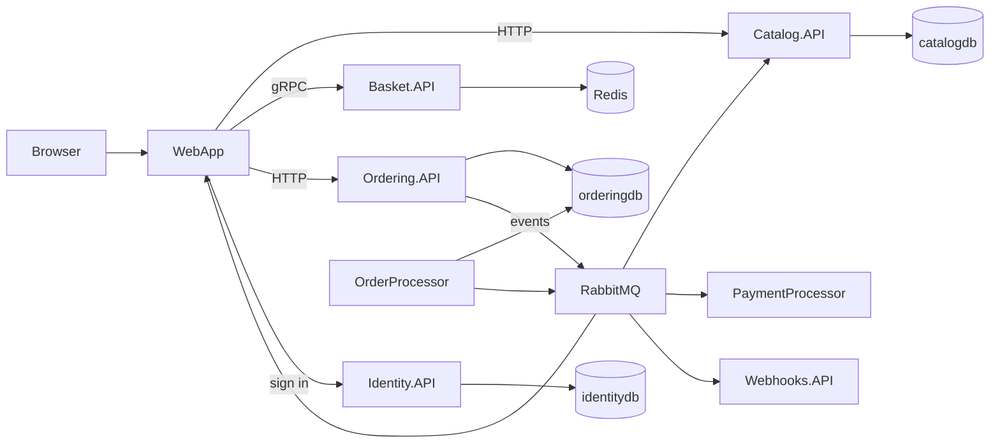

# Read the application as a set of responsibilities

Learning goal: locate the owner of a behavior before editing it. Start at a user action, follow the calls, and stop at each process or persistence boundary.

## The map



This is a learning map, not every reference or every event direction. [AppHost Program.cs](../../src/eShop.AppHost/Program.cs) is the authoritative composition. It also wires a mobile BFF, a webhook client, and webhook storage. AppHost orchestrates resources; business rules belong in the services.

## Where to look

| Responsibility | Starting point | Question to answer |
| --- | --- | --- |
| Local composition | [eShop.AppHost](../../src/eShop.AppHost/Program.cs) | Which references and readiness dependencies exist? |
| Store pages | [WebApp](../../src/WebApp/Components/Pages) | What route renders the UI? |
| Reusable UI and catalog client | [WebAppComponents](../../src/WebAppComponents) | Which code is shared with other clients? |
| Catalog queries and stock | [Catalog.API](../../src/Catalog.API/Apis/CatalogApi.cs) | Who filters, persists, and prices products? |
| Basket protocol and storage | [Basket.API](../../src/Basket.API/Grpc/BasketService.cs) | Which user owns the basket? |
| Order endpoints and use cases | [Ordering.API](../../src/Ordering.API/Apis/OrdersApi.cs) | How does a request become a command? |
| Order business rules | [Ordering.Domain](../../src/Ordering.Domain/AggregatesModel/OrderAggregate/Order.cs) | Which transitions are valid? |
| Order persistence | [Ordering.Infrastructure](../../src/Ordering.Infrastructure/OrderingContext.cs) | Where is the transaction committed? |
| Sign-in configuration | [Identity.API](../../src/Identity.API/Configuration/Config.cs) | Which clients and scopes are configured? |
| Shared service behavior | [ServiceDefaults](../../src/eShop.ServiceDefaults/Extensions.cs) | Where do telemetry and health checks enter? |
| Integration events | [EventBusRabbitMQ](../../src/EventBusRabbitMQ/RabbitMQEventBus.cs) | How is an event routed and acknowledged? |
| Unit and functional tests | [tests](../../tests/README.md) | Which dependencies are real? |

## A deliberate reading order

Read a small method and its caller together. Begin with Catalog.razor, CatalogService, and GetAllItems. Next inspect BasketState, the gRPC client, and the basket repository. Only then trace checkout through OrdersApi, a command handler, Order, and the transaction behavior.

Search by a symbol rather than opening every file:

```powershell
rg -n 'GetAllItems|GetCatalogItems' src tests
rg -n 'CreateOrderAsync|CreateOrderCommandHandler' src tests
rg -n 'RequireAuthorization|AllowAnonymous' src
rg -n 'AddSubscription|BasicAckAsync' src
```

For every hop, write the process, method, input, output, and possible failure. A class name containing “Service” is not proof of a network boundary.

## Worked example: the two basket representations

The basket protocol stores product IDs and quantities. [BasketState](../../src/WebApp/Services/BasketState.cs) fetches product details from Catalog to construct display rows with names and prices. The display row is not the authoritative inventory record. This explains why deleting a catalog product while its ID remains in Redis can break an otherwise valid basket load.

Write this as a dependency: basket display requires both basket quantities and matching catalog records. The eventual missing-product exercise belongs at that joining boundary, not in a CSS file.

## Practice and checkpoint

Draw the browse and add-to-basket paths separately. Label HTTP, gRPC, direct method calls, SQL, and Redis operations. Then explain why a domain unit test can run without the browser and why an API functional test still cannot prove a successful sign-in flow.

Answer: different tests enter the application at different boundaries. Their setup determines what they can prove. Carry that rule into every later stage.
