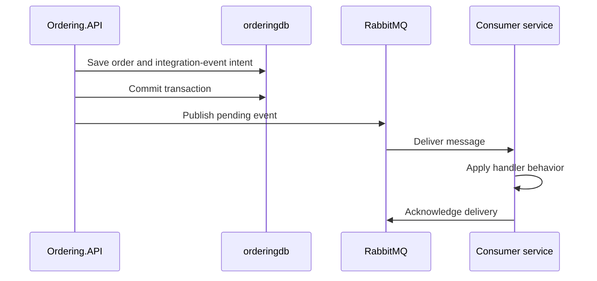

# Follow an order after the HTTP response

Learning goal: distinguish local transactions, publish intent, message delivery, and business completion.

## Trace the chain

An accepted checkout can still be waiting for stock or simulated payment. Start with [OrdersApi](../../src/Ordering.API/Apis/OrdersApi.cs), then [CreateOrderCommandHandler](../../src/Ordering.API/Application/Commands/CreateOrderCommandHandler.cs), Order, and the transaction behavior.

[GracePeriodManagerService](../../src/OrderProcessor/Services/GracePeriodManagerService.cs) checks submitted orders after a grace period. Its event reaches Ordering, which requests stock validation through an integration event. Catalog checks stock; the simulated payment processor responds later. The WebApp subscribes to status events for notifications.

Find each publisher, event type, subscription registration, handler, and resulting state transition. Similar event classes can exist in different services because they represent a serialized contract.

## A database commit is one boundary

Use the sequence as a set of failure windows. What if the API stops after commit but before publish? What if the consumer changes its data but stops before acknowledgement?

[IntegrationEventLogService](../../src/IntegrationEventLogEF/Services/IntegrationEventLogService.cs) retrieves NotPublished entries for a transaction. The publisher marks entries InProgress, Published, or PublishedFailed. That is not proof that an independent worker automatically retries every stranded entry. Locate such a worker before claiming recovery exists.

## Read the acknowledgement behavior

[RabbitMQEventBus](../../src/EventBusRabbitMQ/RabbitMQEventBus.cs) catches handler-processing errors and then acknowledges the message. Its comment explicitly points to dead-letter handling as missing production work. A failed handler can therefore lose its delivery opportunity in this sample.

The exercise is to reproduce the behavior locally, propose a bounded failure policy, and test any prototype. Unbounded immediate requeue can turn one poison message into a busy loop. An infinite retry is not a recovery plan.

For deeper study, use the broker's [consumer acknowledgement documentation](https://www.rabbitmq.com/docs/confirms) and [dead-letter exchange documentation](https://www.rabbitmq.com/docs/dlx). The course's source observations remain specific to this checkout.

## Idempotency is an effect property

[IdentifiedCommandHandler](../../src/Ordering.API/Application/Commands/IdentifiedCommandHandler.cs) uses a request ID and [RequestManager](../../src/Ordering.Infrastructure/Idempotency/RequestManager.cs). Sequential duplicate detection is not automatically safe for simultaneous requests or failed work. Inspect when the request marker is saved and what the handler returns after exceptions.

A useful duplicate test asserts how many business effects occurred. Checking that two responses both contain “OK” is insufficient.

Consumers also need to consider duplicates. Catalog's paid-order handler removes stock; replaying a delivery is a meaningful experiment. The same event ID, two fresh database contexts, and one final stock decrement make a stronger test than calling a mock twice.

## Compatibility exercise

Adding an optional event field can be compatible if older readers ignore it and newer readers define a safe missing-field default. Renaming an event type may also change the routing key because the bus uses the type name. Test serialized fixtures on both sides, not only a shared C# object.

## Stage boundary

Do source tracing and deterministic tests first. Broker failure experiments use an isolated local course instance and synthetic orders. If you cannot provide repeatable infrastructure evidence, label the design unverified and stop short of claims about delivery guarantees.
