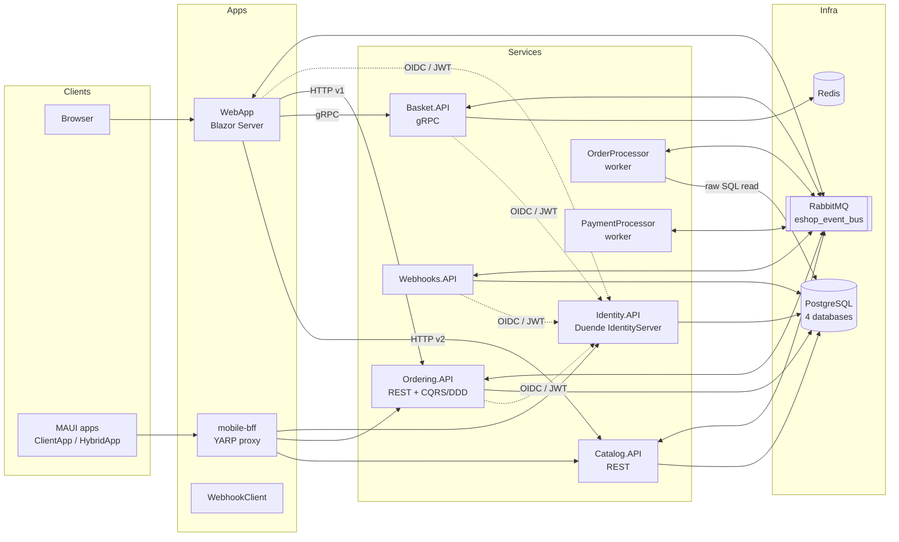

# System Map

## Repo shape

A single .NET solution (`eShop.slnx`) containing ~19 projects that deploy as **separate services** — a "monorepo of microservices." There is also a filtered solution `eShop.Web.slnf` (web-only subset; what CI builds — `ci.yml:L44`) and a root `package.json` whose only job is Playwright e2e tooling.

Source of truth for this picture: `src/eShop.AppHost/Program.cs` (all 116 lines — read it, it *is* the deployment diagram).

## Ownership map

| Area | Projects | Owns | Must NOT own |
| --- | --- | --- | --- |
| UI | `WebApp`, `WebAppComponents`, `ClientApp`, `HybridApp` | rendering, per-user UI state (`BasketState`), calling services | prices, stock, order rules |
| API / edge | `Catalog.API`, `Basket.API`, `Ordering.API`, `Webhooks.API`, mobile-bff (YARP, config in `eShop.AppHost/Extensions.cs`) | contracts, validation, authN | each other's databases |
| Domain | `Ordering.Domain` | order/buyer invariants, state machine, domain events | HTTP, EF, RabbitMQ (it references none of them) |
| Data | `Ordering.Infrastructure`, EF models inside Catalog/Webhooks, `Basket.API/Repositories` | persistence, migrations, transactions | business decisions |
| Async workers | `OrderProcessor`, `PaymentProcessor` | time-driven and reaction-driven progress of orders | user-facing endpoints (they have none) |
| Messaging | `EventBus` (abstractions), `EventBusRabbitMQ` (transport), `IntegrationEventLogEF` (outbox) | delivery, telemetry, outbox bookkeeping | event *meaning* |
| Cross-cutting | `eShop.ServiceDefaults` | OTel, health checks, service discovery, default JWT auth | anything app-specific |
| Identity | `Identity.API` | issuing tokens, user store, client registrations (`Configuration/Config.cs`) | resource-level authorization decisions |

Data ownership (the rule that makes it "microservices" and not "a distributed monolith"): **catalogdb → Catalog.API; orderingdb → Ordering.API (+ read-only trespass by OrderProcessor, `GracePeriodManagerService.cs:L69-L74`); identitydb → Identity.API; webhooksdb → Webhooks.API; Redis → Basket.API.** One Postgres *server*, four *databases* (`eShop.AppHost/Program.cs:L15-L18`) — isolation by database, colocation by server.

## Public interfaces vs private internals

**Public (contracts — changing these is a breaking change):**
- REST: `api/catalog/*` v1+v2 (`CatalogApi.cs:L15-L18`), `api/orders/*` v1 (`OrdersApi.cs:L7-L20`), webhooks endpoints
- gRPC: `src/Basket.API/Proto/basket.proto`
- Integration events: every record in `*/IntegrationEvents/Events/` — these are cross-service wire contracts serialized as JSON, routed by **type name** (`RabbitMQEventBus.cs:L33`). Renaming an event class is a breaking change.
- OIDC surface of Identity.API (scopes: orders, basket, webhooks — `Config.cs:L18-L24`)

**Private (refactor freely):** everything under `Application/`, `Infrastructure/`, `Repositories/`, Razor components, workers' internals.

What a senior inspects first in any repo, in order: (1) the composition root(s) — here AppHost; (2) the contracts — routes, protos, event types; (3) the data ownership map; (4) where money/state changes hands — Ordering. You just did all four.

Interview angle: "monolith vs microservices" questions land better with specifics: *one solution, seven deployables, per-service databases, async-first coordination, one shared identity provider* — then the tradeoff you observed (OrderProcessor's raw-SQL trespass as a pragmatic boundary violation).
